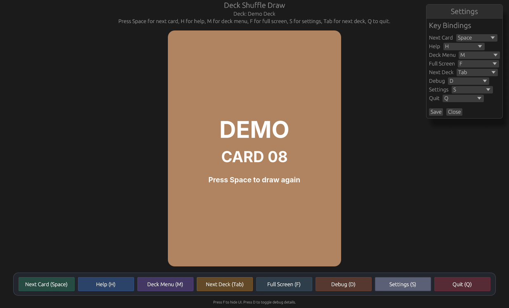

# Deck Shuffle Draw

Small Rust desktop app for drawing a random card from a configured deck.



## Controls

- `Space`: show a random card from the current deck
- click the card image: show the next card
- `H`: show or hide the help image for the current deck
- `M`: open the deck picker
- `F`: hide or show the app UI chrome for a cleaner card view
- `Tab`: switch to the next deck
- `D`: show or hide debug details
- `S`: open or close the settings window
- `Q`: quit

The app also shows on-screen buttons for these actions below the card image.
When the UI chrome is hidden, a subtle `Show UI` button appears in the top-right corner so you can bring the controls back without using the keyboard.

## Asset Layout

Tracked demo assets live under `demo-assets/`.

Local/private card and help images should live under `local-card-images/`.

`local-card-images/` is ignored by git so copyrighted assets are not committed.

Expected layout:

```text
demo-assets/
  decks/
    demo-deck/
  help/
    demo-deck-help.png

local-card-images/
  decks/
    your-deck-1/
    your-deck-2/
  help/
    your-deck-1-help.png
    your-deck-2-help.png
```

## Configuration

The app uses a local `settings.toml`. If it does not exist, the app creates it automatically from `settings.default.toml`.

Keep `settings.default.toml` in git as the shared template, and use `settings.toml` for personal paths or overrides.

Edit [settings.default.toml](./settings.default.toml) for the shared template, or edit your local `settings.toml` for machine-specific values:

- card size
- help image size
- corner radius
- preload behavior
- startup deck
- configured deck list
- keybindings
- toolbar colors

Each deck entry defines:

- `name`: label shown in the app
- `image_dir`: folder containing that deck's card images
- `help_image`: help/reference image shown with `H`

The `[keybindings]` section controls the keyboard shortcuts used by the app. You can also update these from the in-app settings window, and changes are saved back to `settings.toml`.

The `[ui_style]` section controls the toolbar colors using `#RRGGBB` values.

## Run

```bash
cargo run
```

## Local Setup

1. Run the app once, or copy `settings.default.toml` to `settings.toml`.
2. Adjust any local paths or preferences in `settings.toml`.
3. Keep `settings.toml` uncommitted; it is ignored by git.
4. Replace the example deck names and paths with your own local asset names.

## Notes

- Deck images are loaded from disk on demand and can optionally preload in the background.
- Help images are selected per deck.
- The app keeps cached textures in memory while running.
- Changing decks updates `active_deck` in `settings.toml`, so the app reopens on the last selected deck.
- The settings window edits keybindings as a draft and only applies them when you save.
- The hide UI control only hides the app UI chrome; it does not change the operating system window mode.
- The tracked default config points at the demo deck so the app can run without private assets.
